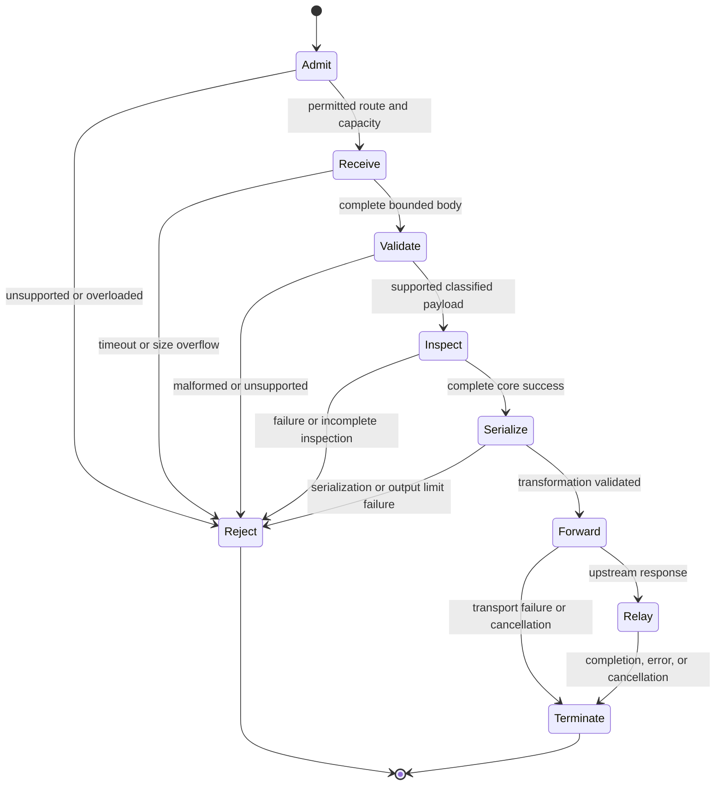

# Architecture

Status: approved design baseline; implementation and numerical limits remain subject to the tracked ADRs and qualification evidence. This document describes the target contract, not implemented features.

## Ownership and dependencies

| Repository | Responsibility |
| --- | --- |
| `redact-secret/redact-secret` | Authoritative deterministic detection and redaction engine |
| `redact-secret/redact-secret-adapters` | In-process host integrations |
| `redact-secret/redact-secret-vault` | Mapping storage and restore authorization |
| `redact-secret/redact-secret-benchmarks` | Measurement and evidence |
| `redact-secret/gateway` | HTTP deployment and protocol boundary |

Gateway depends directly on the Rust core. Core must not depend on Gateway, adapters, or Vault. Network parsing, route selection, JSON field classification, transport, deployment, and operational behavior belong here. Detector logic must not be duplicated here. No Vault dependency is required for the first stable release.

Core issue #1001 retains the architecture origin and cross-repository contract; gateway implementation ownership moves here. Completing this design baseline alone does not satisfy #1001's threat-model and prototype-measurement acceptance criteria.

## Deployment and trust assumptions

Version 0.1.0 targets one application trust domain: a localhost companion or a Kubernetes sidecar. A shared internal gateway is a future scope, even if the executable could technically listen remotely.

The application and Gateway see original plaintext. The provider receives transformed model-bound content plus its required transport credentials. A compromised application can leak before Gateway or bypass it unless the deployment enforces traversal. A compromised Gateway host can inspect memory and credentials; process isolation is not encryption or a trusted execution environment.

Alpha listeners default to loopback. Non-loopback exposure requires an explicitly documented deployment trust model; remote clients and multi-tenant authorization are not qualified for 0.1.0. Implemented in #63 ([ADR 0030](docs/decisions/0030-local-caller-auth-listener-health.md)): an optional local caller token (`deployment.local_auth`, header `X-Gateway-Local-Token`, referenced by environment variable or mounted file, resolved once at startup into an immutable `LocalAuth` in the deployment authority, checked in constant time as the first decision for a proxy `POST`, before any body read, reservation or upstream contact) and a rule that non-loopback binding also requires it; the token never substitutes for provider credentials, is never forwarded, and health probes need no token. Kubernetes binding/address details must be validated against the chosen Pod networking configuration. Upstream TLS certificate and hostname verification are mandatory. First stable does not promise built-in inbound TLS termination; remote exposure is not made supported by placing a TLS reverse proxy in front of it.

## Planned internal structure

One private binary crate initially, with modules for configuration (`config`), admission (`admission`), boundary orchestration (`boundary`), protocol/OpenAI handling (`protocol`), core integration (`core_bridge`), transport (`transport`), health (`health`), and safe telemetry (`telemetry`). Use `docs/decisions/` for ADRs, `docs/contracts/` for protocol/configuration contracts, and `tests/` for synthetic integration tests. Split into internal crates only when concrete dependency or testing needs justify it. Internal modules are not public plugin APIs, and there is no dynamic loader. Everything in this section is planned; no module exists yet (see [ADR 0005](docs/decisions/0005-protocol-expansion-and-central-enforcement.md)).

Authority is centralized and flows one way: `protocol` modules define endpoint-specific parsing, classification, and output rules; `boundary` owns inspection and approval and is the only creator of the sealed final request; `core_bridge` owns pinned core semantics; `admission` owns capacity and permits; `transport` owns routing, TLS, headers, credentials, and transmission. Protocol modules never create HTTP clients or send requests. `protocol::chat` is one file per field family (messages, tool history, tool definitions and schemas, metadata, slots, serialization) with a fixed text-slot order and a per-slot mode (redact, or detect-only for identifiers and keys); the Alpha 2 field contract and the ownership map are in [ADR 0025](docs/decisions/0025-alpha2-field-contract.md) (the new fields are planned, not implemented). New providers reuse the central admission and forwarding checks.

Startup builds one immutable `RuntimePlan` (route/origin mapping, protocol contracts, core profile and policy, limits and deadlines, shared transport clients). Deployment authority, content policy, and resource policy are separate parts of it, and per-request state and credentials stay request-local ([ADR 0006](docs/decisions/0006-runtime-plan-and-authority-separation.md)). Decisions and contracts are indexed in [docs/decisions/README.md](docs/decisions/README.md).

Preferred initial stack: Rust plus Tokio/Axum/Reqwest and a JSON implementation. Selected versions, toolchain, and core pin are recorded in [ADR 0011](docs/decisions/0011-dependency-and-toolchain-selection.md). Measure scan scheduling (inline, bounded `spawn_blocking`, or a dedicated pool) before choosing; synchronous CPU work must not indefinitely monopolize the async reactor. A started synchronous job may be non-interruptible, so the worker owns its CPU and memory permits until real completion ([ADR 0004](docs/decisions/0004-cancellation-and-synchronous-core-work.md)).

## Request state machine

Requests are represented by three types, `ReceivedRequest`, `ValidatedRequest`, and a sealed `SanitizedRequest`. Transport accepts only the last, which only `boundary` can create, after classification, complete core processing, output validation, and association with an approved route plan. There is no raw-body fallback. This is a structural safeguard, not proof of detector coverage ([ADR 0002](docs/decisions/0002-request-states-and-forwarding-authority.md), [request-state contract](docs/contracts/request-state.md)).

No original or partially inspected request-body bytes leave before `Forward`. New upstream requests use the transformed body, recomputed length, and vetted headers. A partial upstream transmission cannot be rolled back; later transport failures must never trigger replay of the original payload. Do not claim cancellation retracts data already delivered to a provider.

## Protocol boundary

Support endpoint-specific request subsets rather than a general JSON/text proxy. Alpha 1 targets `POST /v1/chat/completions`; Beta 1 adds the qualified text subset of `POST /v1/responses` (request contract frozen as a planned design in #82: [responses-request](docs/contracts/responses-request.md), [ADR 0031](docs/decisions/0031-responses-stateless-text-contract.md); request parsing, inspection and serialization implemented through #85 at the protocol and boundary layers; the route, fixed destination and caller-auth boundary are implemented in #86 through the shared `EndpointRoute` handler; relay lifecycle is #87). Route matching is exact. Health/readiness paths are local and never become upstream routes.

Every allowed request field is classified as inspected application text, validated structural/control data, or rejected content. Recursively classify nested fields; unknown fields are rejected by default. Build contracts for prompt/instructions, messages, tool results, app-submitted tool arguments, metadata, and tool descriptions/schema text. Structural values must have an explicit semantic contract: a label such as model ID does not permit arbitrary sensitive text to escape through it. Restrict enums/identifiers/values as needed, reject unsafe/unclassifiable values, and document intentionally transmitted structural data.

Parse JSON once and reject ambiguous input such as duplicate keys. Require valid UTF-8. Inspect decoded strings so JSON escaping cannot bypass checks. Preserve JSON types and keys, and define field traversal and placeholder/session scope deterministically. Do not run a text replacement over raw serialized JSON. English/Korean support derives from the selected core profiles; Gateway tests ensure Unicode and escaping survive transformation.

App-submitted tool arguments may be JSON encoded inside strings. Their interpretation and transformation need a dedicated contract; blindly parsing every string as nested JSON is not acceptable. Redaction does not grant execution permission, and Gateway does not execute tools.

Files, images, audio, URL content, stored conversation/file references, encrypted/opaque content, arbitrary binary uploads, and realtime are initially rejected. Their contents cannot be inspected through the initial text boundary. Request compression is initially rejected; any later support must bound decompressed bytes and expansion. Transport chunking is receipt framing only, never incremental upstream forwarding.

## Core integration

The bridge uses pinned public core APIs and the selected credential/optional PII profile. Gateway controls field selection and transport admission; core controls detection/redaction. Validate core semantics for truncation, maximum findings, detector failures, and partial results. Any signal that inspection was not complete must reject the request. Do not invent a guarantee if a core API lacks the necessary completion signal; track a cross-repository contract blocker instead.

Completeness rules are in the [core-completeness contract](docs/contracts/core-completeness.md); `Policy::compile()` and cooperative cancellation are not assumed to exist until the #5 probe verifies the exact pin. Compile/initialize reusable policies at startup where supported. Mutable per-request state must not cross requests. Placeholder scope and double-redaction behavior are explicit contracts, with tests for inputs already sanitized by adapters. Never trust a client header claiming that input was already scanned.

## Credentials and outbound routing

Alpha uses caller-supplied provider authentication headers. Credentials are necessary transport authority, not model-bound text. No persistent key storage, key broker, or key rotation product is included. A separate local caller token (#63, `deployment.local_auth`) is consumed locally, never forwarded (the outbound header set is an allowlist), and never substitutes for the provider credential.

Configure upstream origins and routes statically. Never derive a destination from caller headers, URL parameters, body values, or absolute-form targets. Disable redirects; do not silently use inherited environment proxy settings. Reject CONNECT and upgrades. Reject disallowed query strings. Define header allowlists, hop-by-hop removal, organization/project header treatment, credential forwarding, and response-header handling. Vetted upstream origins and DNS/network restrictions must prevent SSRF and destination rebinding; do not build arbitrary user-configurable internal service access into the initial scope. Configuration is trusted operator input, but must still be validated against the supported destination policy.

## Responses, retries, and cancellation

Relay qualified upstream JSON and SSE responses; do not claim response redaction. Bound response headers, buffering, total bytes where applicable, stream lifetime, and idle time. Avoid accumulating an entire SSE stream. Propagate downstream disconnects to the upstream operation, bound slow consumers, and terminate stalled streams.

Implemented (#20, [ADR 0017](docs/decisions/0017-json-forwarding-deadlines-and-cancellation.md)): ordinary JSON responses are buffered under hard header and body bounds and finite connect, response-header, and total deadlines, then relayed with the provider's status, allowlisted headers, and unredacted body; the buffer lives under an `UpstreamPermit`. A downstream disconnect drops the request future, which cancels the upstream exchange and releases every permit and buffer, and shutdown drains for a bounded time before cancelling the rest. Bytes already sent to a provider cannot be retracted. SDK qualification (#22) ran the pinned Node.js and Python SDKs against a separate non-release test build ([ADR 0020](docs/decisions/0020-sdk-qualification-test-build.md)); results are in [docs/qualification/alpha1-qualification-report.md](docs/qualification/alpha1-qualification-report.md).

Implemented (#21, [ADR 0018](docs/decisions/0018-sse-relay-termination-and-stream-bounds.md)): `stream: true` takes the same road (the whole request is received, admitted, inspected, and sealed first; every rejection sends zero upstream bytes), then a `2xx` `text/event-stream` answer is relayed incrementally and unredacted. The relay forwards provider bytes unchanged (no event or UTF-8 parsing, no fabricated events), has no tasks and no queue (the HTTP server polls the response body, which polls the provider inline, so a slow consumer backpressures the provider through TCP), and its body owns the upstream and stream permits until the stream really ends, closing the provider connection first. Bounds are an idle deadline, a lifetime deadline, a per-stream buffer bound, and a write-stall deadline on every accepted connection. Failures before the response headers are the ordinary Gateway errors; **after** the headers no status can change, so every failure ends the stream abruptly (no terminating chunk, no completion event, no error event) and the SDK sees a truncated stream. A downstream disconnect, a write stall, or shutdown drops the body and cancels the provider exchange; the Gateway never retries or resumes.

Implemented (#25, [ADR 0019](docs/decisions/0019-request-head-guard-and-one-request-per-connection.md)): every accepted connection runs a request-head guard before the HTTP parser, which answers a head carrying both `Content-Length` and `Transfer-Encoding` with a local `400` (and an over-long head with `431`) and closes the connection, and closes the connection silently for a head not completed within the head deadline (`body_deadline_ms`); the pinned HTTP stack cannot expose the ambiguity itself ([ADR 0021](docs/decisions/0021-framing-ambiguity-parser-level-investigation.md)). Every response carries `Connection: close`, so one request is served per connection. The adversarial qualification suite and the threat-control map are in [docs/qualification/alpha1-threat-control-map.md](docs/qualification/alpha1-threat-control-map.md). The connection count is bounded at accept (#40, [ADR 0022](docs/decisions/0022-connection-bound-at-accept.md)).

The stage-by-stage lifecycle (what each cancellation, deadline, and shutdown does at every stage, who owns the cleanup, what the provider already holds, and the test that covers it) is the [request-lifecycle contract](docs/contracts/request-lifecycle.md) (#59, [ADR 0027](docs/decisions/0027-write-budget-and-bounded-response-frames.md)).

Gateway adds no automatic upstream retries in 0.1.0. SDK retries remain SDK behavior; the observed behavior of the pinned SDKs is recorded in [errors-and-telemetry](docs/contracts/errors-and-telemetry.md) (SDK retry guidance). Do not claim exactly-once delivery. After response headers or stream bytes have been sent, a later error cannot be converted into a new HTTP status; terminate according to the documented stream error contract without falsely reporting normal completion.

## Limits, errors, and telemetry

Choose explicit limits for request bytes, JSON depth/node count, inspected text, findings, transformed output, connections/concurrency, queues, response buffers, and admission/body/upstream/idle/total deadlines. Test near and across each limit; document numeric defaults after measurement. Request memory is bounded in aggregate, not merely per request. Overload fails before unbounded allocation. Capacities for receipt, inspection CPU and queue, buffered memory, upstream calls, and response streams are separate, reserved before allocation or scheduling, and held until the owning resource really ends ([ADR 0003](docs/decisions/0003-resource-admission-and-lifetime.md), [resource-limits contract](docs/contracts/resource-limits.md)). Parsing uses one working structure, rejects duplicate keys, budgets parsed nodes/strings/findings/output, and does not promise secure erasure ([ADR 0007](docs/decisions/0007-parsing-copying-and-plaintext-lifetime.md)). Performance measurement is a gate for every numeric choice ([ADR 0008](docs/decisions/0008-performance-measurement-gate.md)).

Use gateway-owned safe error codes for malformed/unsupported input, limit exhaustion, incomplete scan, overload, and transport failure. Document status mappings and SDK retry implications; gateway errors must not echo payload fragments. Provider response/error bodies are relayed under the supported response contract and can themselves contain sensitive data.

Telemetry may include bounded route IDs, version identifiers, coarse outcomes, timing, and aggregate counters. Exclude bodies, raw URLs/query values, keys, raw findings, matched snippets, unbounded labels, and detector scoring internals. Health reports process liveness; readiness indicates valid configuration, initialized core, and ability to accept work. Neither endpoint probes a provider using a credential by default.

## Qualification and extensions

Tests cover no upstream body on rejection; field coverage; core-result completeness; escaped/Unicode/duplicate-key inputs; structural preservation; credential isolation; redirects/SSRF; resource bounds; stream disconnect/failure/backpressure; SDK retries; and artifact execution.

Gateway owns protocol and transport fixtures; core owns detector regressions; benchmark/evaluation repositories own comparative evidence. Report source commits, exact core pin, configuration/profile, SDK pins, input sizes, concurrency, and methodology for performance claims.

Post-stable expansions require separate ADRs: Anthropic, response inspection, shared gateways, optional Vault contract integration, additional OS artifacts, launchers, and Helm. They are not implied by the initial stable contract.
