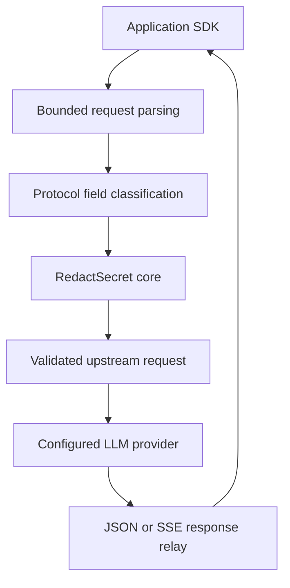

# RedactSecret Gateway

A language-independent LLM egress gateway powered by the RedactSecret Rust detection engine.

## Project status

**Alpha 1 candidate, unpublished.** A working single-application localhost proxy for a text-only subset of OpenAI Chat Completions exists and is qualified as described in [docs/qualification/alpha1-qualification-report.md](docs/qualification/alpha1-qualification-report.md). Nothing is published, signed, or distributable: there is no registry image, no release, no stable support, and no third-party audit. Alpha releases are experimental. Production support begins only after the release qualification gates are satisfied. The unresolved blockers are listed in the qualification report and in the candidate manifest (`distribution_blockers`).

Repository: https://github.com/redact-secret/gateway

Architecture origin: https://github.com/redact-secret/redact-secret/issues/1001

## Purpose

Applications point an existing provider SDK at a local gateway endpoint. For supported requests, the gateway receives the complete bounded JSON body, validates the supported protocol subset, inspects designated application-controlled text through RedactSecret core, and forwards only the successfully processed result to a configured upstream.

The gateway is implemented in Rust. Its HTTP interface is language-independent. Node.js/TypeScript and Python are the first officially qualified client integrations (OpenAI SDK, exact versions below); using another HTTP client does not imply its complete SDK behavior has been qualified.



## Protection contract

- No request-body bytes are sent upstream before complete request admission, inspection, and transformation succeed.
- Unsupported routes, methods, fields, content forms, malformed inputs, exhausted inspection limits, and processing failures are rejected by default.
- Fail-closed means failures do not forward the original request. It does not mean every possible secret is detected. Detector recall is the pinned core's, and is not claimed here.
- Provider credentials in authorized transport headers are treated separately from model-bound text and forwarded only to the configured destination.
- Request bodies, credentials, raw findings, and model responses are excluded from gateway logs and telemetry.
- Initial JSON and SSE responses are relayed without response-content redaction. Upstream errors can contain sensitive content too; applications must handle responses accordingly.
- Inspection covers content present in the supported request. It cannot inspect provider-stored content referenced by an ID or recover content already leaked before this boundary.

Gateway use alone does not enforce traffic traversal. Deployments needing mandatory protection must restrict direct application egress separately. Loopback is an address restriction, not caller authentication: any process on the host that can reach the port can call the gateway with its own provider key. Redaction can change model behavior, invalidate examples, or alter application-submitted tool data; applications must validate these effects.

## What works today and what is planned

| Capability | State |
| --- | --- |
| `POST /v1/chat/completions` text subset: strict admission, duplicate-key-rejecting JSON parsing, field matrix, core inspection with placeholders, validated fresh body, one forward to the fixed OpenAI route | **Implemented** (#18 to #21, #23 to #25) |
| Ordinary JSON response relay (provider status, allowlisted headers, unredacted body, bounded) | **Implemented** (#20) |
| SSE (`stream: true`) incremental relay with idle, lifetime, buffer, and write-stall bounds; truncation is never disguised as completion | **Implemented** (#21) |
| Cancellation (client abort cancels the upstream exchange), permits held until real completion, overload as `503` | **Implemented** (#20, #21, qualified with real SDKs in #22) |
| Static configuration, `validate-config`, loopback health and readiness | **Implemented** |
| Linux x86_64 and macOS ARM64 binaries and a linux/amd64 image, built once from a commit and smoke-tested on their own platform, with a manifest and checksums | **Implemented as an unpublished candidate** (`Candidate artifacts` workflow) |
| Node.js/TypeScript and Python OpenAI SDK qualification, README examples, Compose example | **Implemented** against a separate non-release test build (#22, [ADR 0020](docs/decisions/0020-sdk-qualification-test-build.md)); never run against a real provider by this repository |
| Tools, tool results, and wider field coverage; block/redact policy options | Planned, Alpha 2 (#9) |
| Measured limits (the connection-count bound is implemented, #40, with a provisional default; the request-head caps are measured and confirmed, #41, [ADR 0023](docs/decisions/0023-header-size-measurement-and-size-classes.md)), retry-hint relay, abortive-close signalling of stream truncation | Planned or open follow-ups (#42 to #44; see the report) |
| Responses API text subset, local caller token, configuration schema freeze | Planned, Beta 1 |
| Kubernetes sidecar, Linux ARM64 and multi-architecture image, load and soak | Planned, Beta 2 |
| Security review, SDK compatibility matrix, signing, SBOM, provenance, upgrade and rollback qualification | Planned, Beta 3 |
| Publication of any artifact, registry and image name | **Not authorized**; blocked (private-report test not recorded, registry and name unselected) |

Alpha 1 targets a documented OpenAI Chat Completions text subset (field matrix: [docs/contracts/chat-completions-request.md](docs/contracts/chat-completions-request.md)), including ordinary JSON responses and SSE response relay. Request inspection is buffered; HTTP chunked receipt does not authorize incremental forwarding. Unsupported fields are rejected, never stripped: for example `tools`, `image_url` parts, `metadata`, message `name`, `n` other than 1, and any unknown key. Details of behavior: [configuration](docs/configuration.md), [errors and telemetry](docs/contracts/errors-and-telemetry.md) (including SDK retry guidance), [ADR 0015](docs/decisions/0015-core-inspection-and-request-transformation.md), [ADR 0017](docs/decisions/0017-json-forwarding-deadlines-and-cancellation.md), [ADR 0018](docs/decisions/0018-sse-relay-termination-and-stream-bounds.md), [ADR 0019](docs/decisions/0019-request-head-guard-and-one-request-per-connection.md). `Warn` findings reject by default (`content.on_warn`). The numeric limits and capacity values are **provisional and unmeasured on a quiet host** (ADR 0008).

Unsupported initially: images, audio, files, external content references, provider-stored conversation references, realtime/WebSocket input, transparent MITM, CONNECT tunnels, arbitrary destinations, response redaction, reversible restoration, shared multi-tenant operation, and a policy control plane. Unsupported content is rejected rather than silently bypassed.

## Try it

A clean checkout, a Rust toolchain from `rustup` (the repository pins the compiler), Node.js 24 or newer and/or Python 3.13, and **your own OpenAI API key**. The key is supplied at run time by your application and is never stored by the gateway or committed anywhere. Run steps 4a and 4b in a second terminal while step 3 is running. Statements about how each step was verified are in the last column.

| Step | Command | Verified how |
| --- | --- | --- |
| 1. Build | `cargo build --locked --release` | CI builds this exact command on Linux and macOS |
| 2. Validate the example config | `target/release/redact-secret-gateway validate-config examples/config.openai.json` | CI (tests and candidate smoke checks) |
| 3. Start it | `target/release/redact-secret-gateway serve examples/config.openai.json` (listens on `127.0.0.1:8787`; Ctrl-C or SIGTERM stops it) | CI smoke checks start the candidate binary and probe it with rejected-only requests |
| 4a. Node example | `cd examples/node && npm ci --ignore-scripts && export OPENAI_API_KEY=... && npm start` | Run in CI against the **qualification build** with a fake provider and a synthetic key |
| 4b. Python example | `cd examples/python && python3 -m venv .venv && .venv/bin/pip install --require-hashes --no-deps -r requirements.txt && export OPENAI_API_KEY=... && .venv/bin/python openai_via_gateway.py` | Same |
| Try the redaction | add `-- --demo-redaction` (Node) or `--demo-redaction` (Python): sends a synthetic, revoked-looking token that the gateway replaces with `<SECRET_1>` | Same |

The examples set the SDK `baseURL` to `http://127.0.0.1:8787/v1`, disable SDK retries (so a failed request is never silently re-sent to the provider; see the retry guidance), and in Node check `finish_reason` on streams. With a real key the request goes to `api.openai.com` through the gateway: that final hop (public DNS, TLS to the provider) is the one thing no CI run in this repository exercises. Pin: npm `openai` 7.27.0 (lockfile with integrity hashes), PyPI `openai` 3.24.0 (`requirements.txt` with sha256 hashes).

Docker Compose: build the local candidate image (`sh scripts/build-image.sh target/release/redact-secret-gateway redact-secret-gateway:candidate`, Linux x86_64 binary required, or take it from the `alpha1-candidate-<sha>` workflow bundle) and `docker compose -f examples/compose/compose.yaml up -d`; the port is published to host loopback only. There is no registry image yet. The Compose file and the image are started and probed in CI against the exact candidate image.

## Initial scope

The first product is a single-application localhost proxy or Kubernetes sidecar, with static configuration, fixed upstream routing, bounded resource consumption, health/readiness endpoints, and explicit fail-closed semantics.

Behavior in one paragraph: on `POST /v1/chat/completions`, an admitted and validated request is inspected through the pinned core (profile and optional PII selection from the static `content` policy), transformed into a fresh bounded body, and forwarded once, through the central transport only, to the fixed provider route when the deployment configures an upstream (`deployment.upstream.provider: openai`); with none configured the route answers `501`. The provider's JSON response is relayed with its status code, allowlisted headers, and an **unredacted** body under finite connect, response-header, and total deadlines and hard byte bounds. `stream: true` takes the same road and the provider's `text/event-stream` answer is relayed incrementally and unredacted. After the response headers, a failure ends the stream abruptly with no completion event; the Python SDK raises, the Node.js SDK raises on Node 24 but ended the stream normally on Node 22.16.0, so Node callers should check `finish_reason`. Bytes already sent to a provider cannot be retracted when a caller disconnects. Gateway-side failures are fixed safe codes. Each connection serves one request.

## Planned distribution

| Artifact | First stage | Purpose |
| --- | --- | --- |
| `redact-secret-gateway` executable | Alpha 1 (unpublished candidate) | Service execution, configuration validation, version reporting |
| OCI container image, registry/name to be finalized | Alpha 1 (unpublished candidate) | Same service packaged for Docker |
| Configuration schema and examples | Alpha 1 | Inspectable static configuration contract |
| Node and Python examples | Alpha 1 | Connect existing SDKs without another gateway SDK |
| Docker Compose example | Alpha 1 | Local reproducible deployment |
| Kubernetes sidecar manifests | Beta 2 | Single-application deployment qualification |

The test binary `redact-secret-gateway-qualification` is **not** a distribution artifact: it exists only to qualify the SDKs against a fake provider and is never uploaded, published, or shipped (ADR 0020). No separate npm/PyPI launcher, language-specific gateway SDK, public provider crate, or Helm chart is required for 0.1.0. Those may be considered after demonstrated demand.

## Release roadmap

| Milestone | Release direction | Exit evidence |
| --- | --- | --- |
| Alpha 1 | Rust scaffolding, bounded Chat Completions text subset, core bridge, JSON/SSE relay, initial binary/image/examples | No upstream body on rejected requests; Node/Python SDK qualification; verified initial artifacts (see the qualification report for what is met and what remains) |
| Alpha 2 | Tool text coverage, complete field contracts, block/redact policy, limits and failures | Field classification and structural preservation tests; error/cancellation tests |
| Beta 1 | Responses API text subset, local caller token, configuration schema freeze | Endpoint compatibility and credential-boundary qualification |
| Beta 2 | Kubernetes sidecar, Linux ARM64/multi-architecture image, load/soak/recovery | Published resource budgets and repeatable operational evidence |
| Beta 3 | Security review, SDK compatibility matrix, artifact provenance, documentation and upgrade/rollback qualification | Release candidate gates satisfied or explicitly blocked with owners |

Stable 0.1.0 follows Beta 3 when evidence is sufficient. No date or automatic promotion is implied. Anthropic is a proposed post-0.1.0 expansion, requiring its own protocol and qualification contract.

Initial target artifacts are Linux x86_64 and macOS ARM64 binaries, and a Linux amd64 image. Linux ARM64 and a multi-architecture image are added during beta. Windows and macOS x86_64 are later candidates, not initial support claims.

Gateway releases have an independent version. Each release records its exact core version/commit, supported request subset, configuration schema, SDK versions, and artifact platforms. Core upgrades are explicit qualification changes, not automatic dependency refreshes.

## Development

The Rust crate is a private binary (`0.1.0-alpha.0`) with a pinned toolchain (`rust-toolchain.toml`, Rust 1.98.1, MSRV 1.88), a committed `Cargo.lock`, and an exact core pin (`redact-secret =0.1.0-beta.12`). Selected versions and features are in [ADR 0011](docs/decisions/0011-dependency-and-toolchain-selection.md). The header, credential, destination, and transport contracts are in [docs/contracts](docs/contracts/README.md). See [docs/configuration.md](docs/configuration.md).

Commands that work today (install Rust through `rustup`; the toolchain file selects the compiler):

```bash
cargo build --locked
cargo fmt --check
cargo clippy --locked --all-targets -- -D warnings
cargo test --locked          # unit, API-boundary (trybuild), dependency and destination policy, harness, permit, parser, no-forward, and leakage tests
cargo run --locked -- --version
cargo run --locked -- validate-config examples/config.openai.json
cargo run --locked -- serve examples/config.openai.json     # 127.0.0.1:8787, proxy route + /healthz, /readyz; SIGINT/SIGTERM to stop
cargo deny check             # requires cargo-deny; policy in deny.toml
cargo run --locked --example perf_workloads -- --smoke   # synthetic workload scaffold (measurement tool, no performance claim)
```

SDK qualification (separate non-release build, Node 24 and Python 3.13, loopback only, no key):

```bash
sh qualification/build.sh                                     # generates and builds redact-secret-gateway-qualification
(cd qualification/sdk/node && npm ci --ignore-scripts)       # also examples/node
(cd qualification/sdk/python && python3 -m venv .venv && .venv/bin/pip install --require-hashes --no-deps -r requirements.txt)   # also examples/python
sh qualification/run-suites.sh                                # fake provider + gateways + Node suite + Python suite + README examples
```

The same commands run in CI (`.github/workflows/ci.yml`, required aggregate check `CI passed`; `.github/workflows/qualification.yml`, `Qualification passed`) against the committed lockfiles and the pinned toolchain. Ordinary CI and the qualification workflow use no secrets, no provider credentials, and no provider network calls: tests talk only to loopback fakes with synthetic data. See [CONTRIBUTION.md](CONTRIBUTION.md#test-harness-and-ci) for the harness.

Unpublished release-candidate builds (Linux x86_64, macOS ARM64, a Linux amd64 image, manifest, checksums, smoke evidence) are produced by `.github/workflows/artifacts.yml`; see [docs/artifacts.md](docs/artifacts.md) and [ADR 0012](docs/decisions/0012-release-candidate-artifact-build.md). Nothing is published, signed, or distributable until the gates in that document are met (private-report verification, ADR 0010; registry and name selection; maintainer authorization).

Read [ARCHITECTURE.md](ARCHITECTURE.md), [CONVENTIONS.md](CONVENTIONS.md), [CONTRIBUTION.md](CONTRIBUTION.md), and [SECURITY.md](SECURITY.md) before implementation.

The gateway is licensed under the MIT License; see [LICENSE](LICENSE). Private vulnerability reporting is enabled for the repository; verified through the GitHub API on 2026-10-02 (see [SECURITY.md](SECURITY.md) and ADR 0010).
