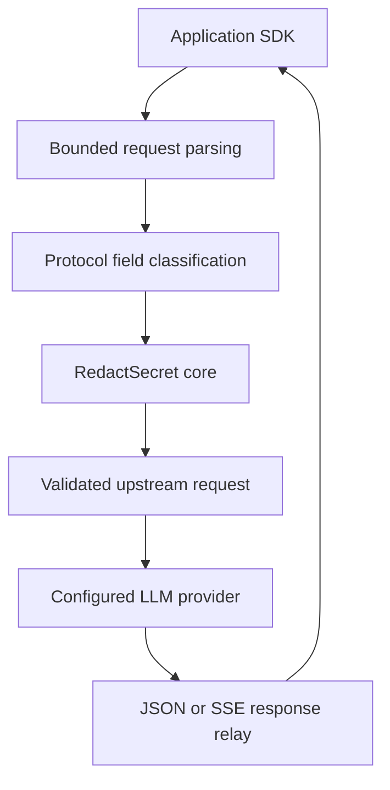

# RedactSecret Gateway

A language-independent LLM egress gateway powered by the RedactSecret Rust detection engine.

## Project status

This repository is in architecture and scaffolding development. The capabilities below are the approved target design, not a statement that a runnable gateway or released artifacts already exist. Alpha releases are experimental. Production support begins only after the release qualification gates are satisfied.

Repository: https://github.com/redact-secret/gateway

Architecture origin: https://github.com/redact-secret/redact-secret/issues/1001

## Purpose

Applications point an existing provider SDK at a local gateway endpoint. For supported requests, the gateway receives the complete bounded JSON body, validates the supported protocol subset, inspects designated application-controlled text through RedactSecret core, and forwards only the successfully processed result to a configured upstream.

The gateway is implemented in Rust. Its HTTP interface is language-independent. Node.js/TypeScript and Python are the first officially qualified client integrations; using another HTTP client does not imply its complete SDK behavior has been qualified.

## Protection contract

- No request-body bytes are sent upstream before complete request admission, inspection, and transformation succeed.
- Unsupported routes, methods, fields, content forms, malformed inputs, exhausted inspection limits, and processing failures are rejected by default.
- Fail-closed means failures do not forward the original request. It does not mean every possible secret is detected.
- Provider credentials in authorized transport headers are treated separately from model-bound text and forwarded only to the configured destination.
- Request bodies, credentials, raw findings, and model responses are excluded from gateway logs and telemetry.
- Initial JSON and SSE responses are relayed without response-content redaction. Upstream errors can contain sensitive content too; applications must handle responses accordingly.
- Inspection covers content present in the supported request. It cannot inspect provider-stored content referenced by an ID or recover content already leaked before this boundary.

Gateway use alone does not enforce traffic traversal. Deployments needing mandatory protection must restrict direct application egress separately. Redaction can change model behavior, invalidate examples, or alter application-submitted tool data; applications must validate these effects.

## Initial scope

The first product is a single-application localhost proxy or Kubernetes sidecar, with static configuration, fixed upstream routing, bounded resource consumption, health/readiness endpoints, and explicit fail-closed semantics.

Alpha 1 targets a documented OpenAI Chat Completions text subset, including ordinary JSON responses and SSE response relay. Request inspection is buffered; HTTP chunked receipt does not authorize incremental forwarding. Tool payload coverage is expanded and qualified in Alpha 2. Responses API text support is planned for Beta 1.

Unsupported initially: images, audio, files, external content references, provider-stored conversation references, realtime/WebSocket input, transparent MITM, CONNECT tunnels, arbitrary destinations, response redaction, reversible restoration, shared multi-tenant operation, and a policy control plane. Unsupported content is rejected rather than silently bypassed.

## Planned distribution

| Artifact | First stage | Purpose |
| --- | --- | --- |
| `redact-secret-gateway` executable | Alpha 1 | Service execution, configuration validation, version reporting |
| OCI container image, registry/name to be finalized | Alpha 1 | Same service packaged for Docker |
| Configuration schema and examples | Alpha 1 | Inspectable static configuration contract |
| Node and Python examples | Alpha 1 | Connect existing SDKs without another gateway SDK |
| Docker Compose example | Alpha 1 | Local reproducible deployment |
| Kubernetes sidecar manifests | Beta 2 | Single-application deployment qualification |

No separate npm/PyPI launcher, language-specific gateway SDK, public provider crate, or Helm chart is required for 0.1.0. Those may be considered after demonstrated demand.

## Release roadmap

| Milestone | Release direction | Exit evidence |
| --- | --- | --- |
| Alpha 1 | Rust scaffolding, bounded Chat Completions text subset, core bridge, JSON/SSE relay, initial binary/image/examples | No upstream body on rejected requests; Node/Python smoke tests; verified initial artifacts |
| Alpha 2 | Tool text coverage, complete field contracts, block/redact policy, limits and failures | Field classification and structural preservation tests; error/cancellation tests |
| Beta 1 | Responses API text subset, local caller token, configuration schema freeze | Endpoint compatibility and credential-boundary qualification |
| Beta 2 | Kubernetes sidecar, Linux ARM64/multi-architecture image, load/soak/recovery | Published resource budgets and repeatable operational evidence |
| Beta 3 | Security review, SDK compatibility matrix, artifact provenance, documentation and upgrade/rollback qualification | Release candidate gates satisfied or explicitly blocked with owners |

Stable 0.1.0 follows Beta 3 when evidence is sufficient. No date or automatic promotion is implied. Anthropic is a proposed post-0.1.0 expansion, requiring its own protocol and qualification contract.

Initial target artifacts are Linux x86_64 and macOS ARM64 binaries, and a Linux amd64 image. Linux ARM64 and a multi-architecture image are added during beta. Windows and macOS x86_64 are later candidates, not initial support claims.

Gateway releases have an independent version. Each release records its exact core version/commit, supported request subset, configuration schema, SDK versions, and artifact platforms. Core upgrades are explicit qualification changes, not automatic dependency refreshes.

## Development

Scaffolding will establish reproducible commands, a pinned toolchain, and dependency versions. Until then, there is no installation or run command advertised as working. Tokio, Axum, and Reqwest are the preferred transport candidates, subject to the initial ADR and prototype evidence.

Read [ARCHITECTURE.md](ARCHITECTURE.md), [CONVENTIONS.md](CONVENTIONS.md), [CONTRIBUTION.md](CONTRIBUTION.md), and [SECURITY.md](SECURITY.md) before implementation.

The license must be explicitly selected and added before publishing artifacts. This document does not grant a license or copy the core license into the gateway.
